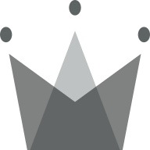

<!--
*** Thanks for checking out the Best-README-Template. If you have a suggestion
*** that would make this better, please fork the repo and create a pull request
*** or simply open an issue with the tag "enhancement".
*** Thanks again! Now go create something AMAZING! :D
-->

<!-- PROJECT SHIELDS -->
<!--
*** I'm using markdown "reference style" links for readability.
*** Reference links are enclosed in brackets [ ] instead of parentheses ( ).
*** See the bottom of this document for the declaration of the reference variables
*** for contributors-url, forks-url, etc. This is an optional, concise syntax you may use.
*** https://www.markdownguide.org/basic-syntax/#reference-style-links
-->

[![Contributors][contributors-shield]][contributors-url]
[![Forks][forks-shield]][forks-url]
[![Stargazers][stars-shield]][stars-url]
[![Issues][issues-shield]][issues-url]
[![MIT License][license-shield]][license-url]
[![LinkedIn][linkedin-shield]][linkedin-url]

<!-- PROJECT LOGO -->
<br />
<p align="center">
  <a href="https://bogi-clothing.herokuapp.com">
    
  </a>

  <h3 align="center">React Clothing</h3>

  <p align="center">
    <br />
    <a href="https://bogi-clothing.herokuapp.com/">View Demo</a>
    ·
    <a href="https://github.com/dimitur2204/react-cloth/issues">Report Bug</a>
    ·
    <a href="https://github.com/dimitur2204/react-cloth/issues">Request Feature</a>
  </p>
</p>

<!-- TABLE OF CONTENTS -->
<details open="open">
  <summary>Table of Contents</summary>
  <ol>
    <li>
      <a href="#about-the-project">About The Project</a>
      <ul>
        <li><a href="#built-with">Built With</a></li>
      </ul>
    </li>
    <li>
      <a href="#getting-started">Getting Started</a>
      <ul>
        <li><a href="#prerequisites">Prerequisites</a></li>
        <li><a href="#installation">Installation</a></li>
      </ul>
    </li>
    <li><a href="#usage">Usage</a></li>
    <li><a href="#roadmap">Roadmap</a></li>
    <li><a href="#contributing">Contributing</a></li>
    <li><a href="#license">License</a></li>
    <li><a href="#contact">Contact</a></li>
    <li><a href="#acknowledgements">Acknowledgements</a></li>
  </ol>
</details>

<!-- ABOUT THE PROJECT -->

## About The Project

[![React Cloth][product-screenshot]](./client/public/screenshot.png)

A Progressive Web App (PWA) e-commerce platform aimed to show off my React skills. You can check it out live at the link above. You can register with email or sign-in with Google. Add items to your cart and checkout with Stripe.
### Built With

This section should list any major frameworks that you built your project using. Leave any add-ons/plugins for the acknowledgements section. Here are a few examples.

- [React](https://reactjs.org/)
- [Typescript](https://www.typescriptlang.org/)
- [Redux](https://redux.js.org/)
- [Redux-Saga](https://redux-saga.js.org/)
- [styled-components](https://styled-components.com/)
- [Firebase](https://firebase.google.com/)
- [GitHub Actions](https://docs.github.com/en/actions)
- [Jest](https://jestjs.io)

<!-- GETTING STARTED -->

## Getting Started

To get a local copy up and running follow these simple example steps.

### Prerequisites
Make sure you have npm/yarn on your machine and in the PATH variables.

### Installation
1. Clone the repo
   ```sh
      git clone https://github.com/dimitur2204/react-cloth.git
   ```
2. Install NPM packages
  Run in the root folder
   ```sh
      npm install
   ```
   or 
    ```sh
     yarn
   ```
   
3. To start a local dev environment open the root folder and run
  ```sh
  yarn dev
  ```
or

  ```sh
  npm run dev
  ```
  
4. To get a production ready bundle run
- yarn build
  ```sh
  yarn build
  ```
or

- npm run build
  ```sh
  npm run build
  ```

<!-- ROADMAP -->

## Roadmap

See the [open issues](https://github.com/dimitur2204/react-cloth/issues) for a list of proposed features (and known issues).

<!-- CONTRIBUTING -->

## Contributing

Contributions are what make the open source community such an amazing place to be learn, inspire, and create. Any contributions you make are **greatly appreciated**.

1. Fork the Project
2. Create your Feature Branch (`git checkout -b feature/AmazingFeature`)
3. Commit your Changes (`git commit -m 'Add some AmazingFeature'`)
4. Push to the Branch (`git push origin feature/AmazingFeature`)
5. Open a Pull Request

<!-- LICENSE -->

## License

Distributed under the MIT License. See `LICENSE` for more information.

<!-- CONTACT -->

## Contact

Your Name - [@dimitur2204](https://twitter.com/dimitur2204) - dimitur2204@gmail.com

Project Link: [https://github.com/dimitur2204/react-cloth](https://github.com/dimitur2204/react-cloth)

<!-- ACKNOWLEDGEMENTS -->

## Acknowledgements

- [Img Shields](https://shields.io)
- [Heroku](https://heroku.com)

<!-- MARKDOWN LINKS & IMAGES -->
<!-- https://www.markdownguide.org/basic-syntax/#reference-style-links -->

[contributors-shield]: https://img.shields.io/github/contributors/dimitur2204/react-cloth.svg?style=for-the-badge
[contributors-url]: https://github.com/dimitur2204/react-cloth/graphs/contributors
[forks-shield]: https://img.shields.io/github/forks/dimitur2204/react-cloth.svg?style=for-the-badge
[forks-url]: https://github.com/dimitur2204/react-cloth/network/members
[stars-shield]: https://img.shields.io/github/stars/dimitur2204/react-cloth.svg?style=for-the-badge
[stars-url]: https://github.com/dimitur2204/react-cloth/stargazers
[issues-shield]: https://img.shields.io/github/issues/dimitur2204/react-cloth.svg?style=for-the-badge
[issues-url]: https://github.com/dimitur2204/react-cloth/issues
[license-shield]: https://img.shields.io/github/license/dimitur2204/react-cloth.svg?style=for-the-badge
[license-url]: https://github.com/dimitur2204/react-cloth/blob/master/LICENSE
[linkedin-shield]: https://img.shields.io/badge/-LinkedIn-black.svg?style=for-the-badge&logo=linkedin&colorB=555
[linkedin-url]: https://www.linkedin.com/in/dimitar-nizamov-9180121a2/
[product-screenshot]: ./client/public/screenshot.png
